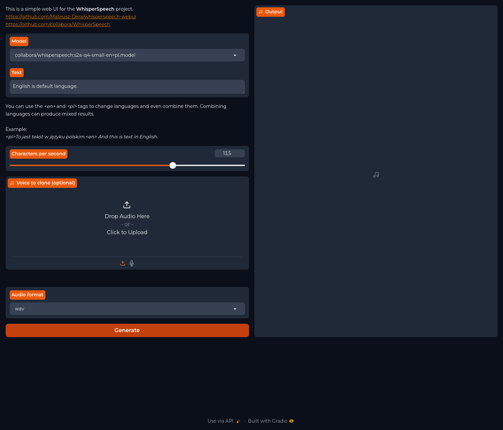

# WhisperSpeech web UI
Web UI for WhisperSpeech (https://github.com/collabora/WhisperSpeech)



## Info
[](https://github.com/Mateusz-Dera/WhisperSpeech-Web-UI/blob/main/README.md)

> [!Note]
> Version 2.x now allows voice generation via API.

### Test platforms:
|Name|Info|
|:---|:---|
|CPU|AMD Ryzen 7900X3D (iGPU disabled in BIOS)|
|GPU|AMD Radeon 7900XTX|
|RAM|64GB DDR5 6600MHz|
|Motherboard|ASRock B650E PG Riptide WiFi (BIOS 2.10)|
|OS|Ubuntu 24.04|
|Kernel|6.8.0-39-generic|
|ROCm|6.2.1|

|Name|Info|
|:---|:---|
|CPU|IntelCore i5-12500H|
|GPU|NVIDIA GeForce RTX 4050|
|RAM|16GB DDR4 3200MHz|
|Motherboard|GIGABYTE G5 MF (BIOS FB10)|
|OS|Ubuntu 24.10|
|Kernel|6.11.0-9-generic|
|NVIDIA Driver|560.35.03|
|CUDA|12.6.2|

## Instalation:
1\. Install Python 3.12

2\. Clone repository

3\. Mount the repository directory.

3\. Create and activate venv

4\. For ROCm set HSA_OVERRIDE_GFX_VERSION.
For the Radeon 7900XTX:
```bash
export HSA_OVERRIDE_GFX_VERSION=11.0.0
```
5\. Install ffmpeg:

Ubuntu 24.04/24.10:
```bash
sudo apt install ffmpeg
```

6\. Install requirements

CPU (not recommended):
```bash
TODO
```

CUDA 12.4:
```bash
pip install -r requrements_cuda_12.1.txt
```

ROCm 6.2
```bash
pip install -r requirements_rocm_6.2.txt
```

7\. Run:
```bash
python webui.py
```
With -h or --help for help:
```bash
python webui.py -h
```
## GUI tanslation:
|Languages|
|:---|
|English|
|Polish|

<!-- TRANSLATION -->
1\. Install PyBabel:
```bash
pip install babel==2.16.0
```

2\. Extract messages.pot:
```bash
pybabel extract -F babel.cfg -o ./locale/messages.pot . 
```

3\. Create new:
```bash
pybabel init -i ./locale/messages.pot -d ./locale -l pl_PL
# Replace pl_PL by your language
```

4\. Compile:
```bash
pybabel compile -d ./locale